# knivesysl

**a bare-cuda inference engine for qwen3.8-27b on one rtx 5090. fp6 weights, 4-bit kv,
256k context, hand-written sm120 tensor-core kernels. no pytorch, no cublas, no cutlass
on the run path — one cuda translation unit behind a c ctypes abi.**

knivesysl is two things:

- **the engine** — 22k lines of cuda in a single tu, loaded by python over ctypes.
  the python side tokenizes and speaks http; every flop happens in `libforward_qwen.so`.
- **the format** — knivesysl fp6 (e2m3, 128-wide block scales, qmma fragment layout).
  6 bits per weight on the tensor cores, which is what makes 27b + 256k fit in 32 gb
  while staying above nvfp4 on quality.

right now it runs **exactly one model**: the qwen3.8-27b text tower (64 layers, 5120
hidden, 16 full-attention + 48 gated-deltanet). same layout as qwen3.6-27b, which also
converts. it is sm120-only and not portable — that is the trade being made.

```
qwen3.8-27b (hf, bf16)
   --> convert_qwen_tqf.py --> model.tqf   (fp6 e2m3 + block scales + mtp head, 22.6 gb)
   --> libforward_qwen.so                  (one cuda tu, compute_120f)
   --> serve_openai.py                     (single stream + mtp spec-decode)
    or serve_batched.py                    (paged kv + continuous batching)
   --> /v1/chat/completions
```

---

## why fp6

nvfp4 is 4 bits with a scale per 16 values. knivesysl fp6 is 6 bits with a pow2 scale per
128. more mantissa, coarser scaling --> better reconstruction of the weight distribution
at 1.4x the bytes, and still small enough that the whole tower plus a 256k kv cache lives
on one consumer card.

| format | bits/param | tf-top1 vs bf16 |
|---|--:|--:|
| fp8 | 8 | 95.94 |
| **knivesysl fp6 (e2m3)** | **6** | **91.30** |
| e2m1 (opt-in 4-bit tier) | 4 | 86.46 |
| nvfp4 | 4 | 85.78 |

quality figures carry over from the fork this began as and are pending our own
re-measurement; every performance number below we measured ourselves on this card.

---

## numbers

all measured 2026-08 on one rtx 5090 (gb202, sm120, 170 sm, 32 gb, 128 mb l2), cuda 13.3,
driver 595. the vllm column is vllm 0.27.1 serving `unsloth/qwen3.8-27b-nvfp4` (mixed
w8a8 + w4a4, 22.5 gb — footprint-matched to our 22.6 gb) at `--max-model-len 16384
--gpu-memory-utilization 0.90`. both engines driven by the same client, greedy, thinking
off.

### decode — we win

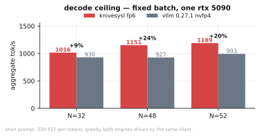

a decode step is one pass over ~20 gib of weights whatever the batch size, so decode is
memory-bound and fewer weight bytes wins. the lead widens with concurrency because the
4-bit kv and the o(1) deltanet state keep 52 sequences resident in 30.8 gib.

single stream with mtp spec-decode: **86.8 tok/s** end-to-end vs vllm's 58.7 (+48%),
accept-length 2.7-3.3.

### decode holds its shape with depth

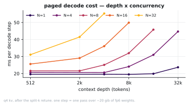

after retuning the split-k gate for the paged attention: 16384/n=8 went **129.5 --> 45.9
ms/step**, 4096/n=8 **46.0 --> 25.1**. split-k is a different reduction order, so it is
eps-equivalent rather than bit-exact — 98.32% teacher-forced top-1 agreement (13 flips in
776 positions). `TQ_PAGED_SPLIT=1` forces the single-kernel path.

### prefix reuse

the single-stream path snapshots kv **and** the deltanet recurrent state at a 128-aligned
anchor, so a follow-up turn re-prefills only the suffix:

```
159k-token conversation --> cold 126.9 s --> follow-up 0.52 s   (158 848 / 158 967 reused)
  8k-token conversation --> cold   3.6 s --> follow-up 0.23 s   (  7 808 /   8 203 reused)
```

the batched server has the same primitive for a shared system prompt: **340 --> 784 tok/s**
at n=32, p50 latency 14.5 --> 6.2 s.

### apc phase 3 — mid-prefill checkpoints, coalescing admission

the hybrid cannot reuse kv at arbitrary block boundaries — the deltanet state is not
rewindable — so a cache entry is a *checkpoint*: refcounted references to the full kv
blocks plus a copy of the o(1) recurrent state (151.5 mb), saved mid-prefill at the two
boundaries agentic traffic actually revisits: the lcp junction with the previous prompt
(turn append) and `n_prompt - 8` (exact resend, trimmed so the next turn's `<think>`
re-render still prefix-matches). admission adopts the deepest match and prefills only
the suffix; same-prefix requests arriving while a donor is mid-prefill are held a few
waves and adopt its checkpoint instead of racing it (6 concurrent arrivals = 2 full
prefills, not 6). n-way lru, state slabs in one pool allocated on first save
(`TQ_CKPT_POOL`, default 6 x 151.5 mb), every failure path degrades to a plain full
prefill. save/evict/adopt are logged as `[ckpt]` lines.

measured 2026-08-31 on the production build, same server with `--no-prefix-cache` as
the control, real token counts (the bench's chars/token estimate undercounts — "24k"
labels are 33.2k real tokens):

| scenario | off | on | |
|---|--:|--:|--:|
| turn append, 36k -> 50.4k ctx (+2.9k/turn) | 5.97-8.22 s | 0.61-0.78 s flat | 9-11x |
| session resend, all six depths | 5.6-8.2 s | **0.071-0.085 s** | **75-98x** |
| 6-way fan-out, 33.2k shared, cold | wall 24.6 s | wall 5.26 s | 4.7x |
| 6-way fan-out, checkpoint pre-exists | wall 24.6 s | **wall 0.67 s** | **37x** |
| decode on adopted state | 58.0 tok/s cold | 58.1 tok/s | no penalty |

adopted output is bit-identical at temperature 0 (probed live on the production build).

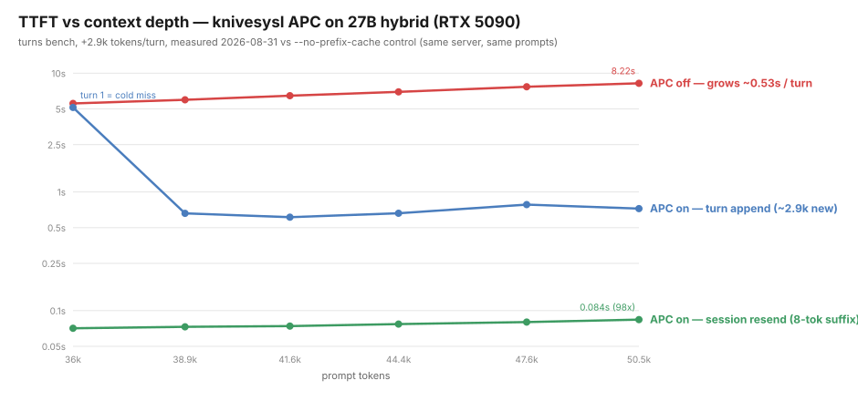
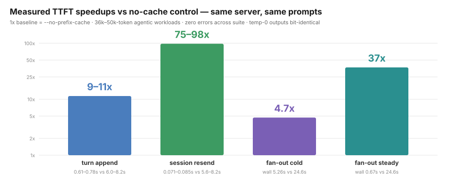
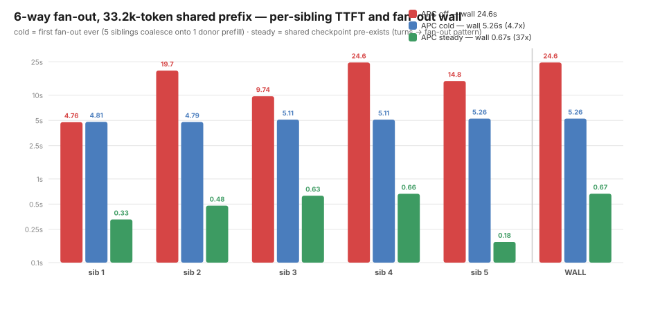
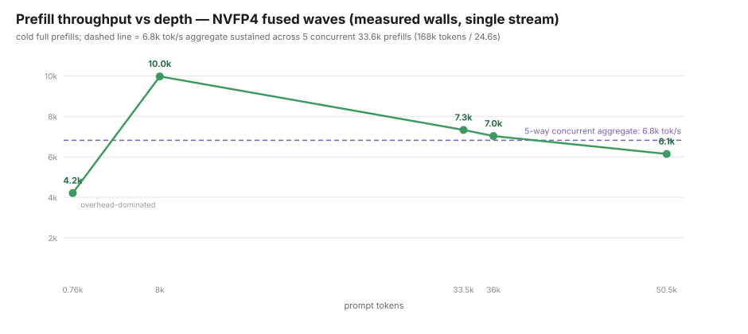
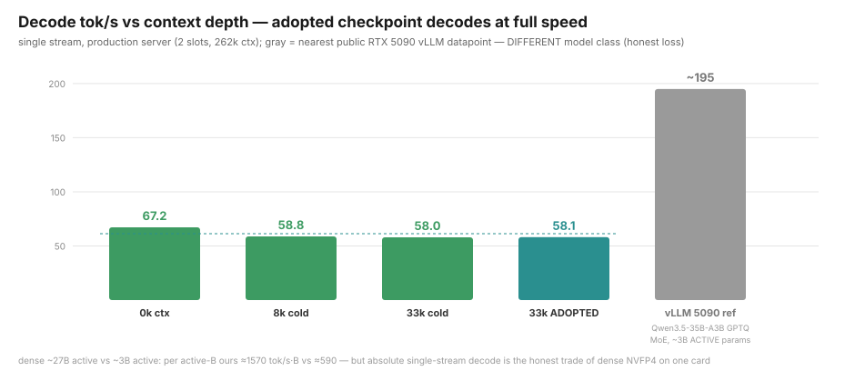

vs vllm v1's hybrid apc (dense align-mode, 528-token blocks): a resend hit here
recomputes 8 tokens against their <=527 (0% hit below 528 tokens — their #40696); a
cached 33k session pins 0.15 gb of state here against ~4.7 gb dense [derived on our
state shapes], which on a 32 gb card is ~6 resident sessions vs ~2; and they have no
fan-out coalescing (tracking #26201). the honest losses: a mid-context divergence at a
junction never seen as consecutive admissions pays a full prefill where their 528 grid
reuses up to the divergence block (the lcp save catches any junction after one
co-occurrence), and absolute single-stream decode (58-67 tok/s, dense ~27b active)
sits below moe-class numbers on this card — apc stops you re-paying prefill, it does
not move the weight-read roofline.

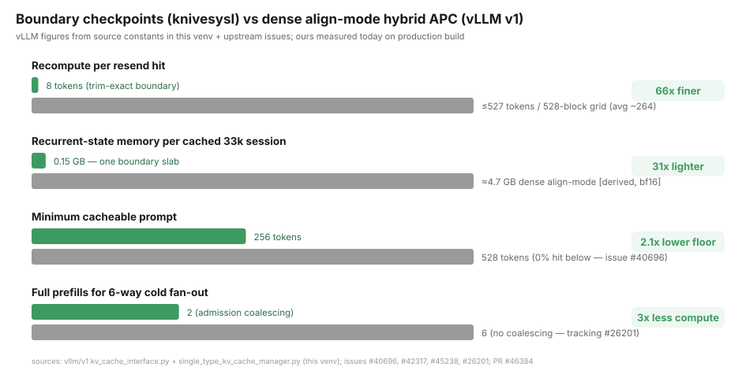
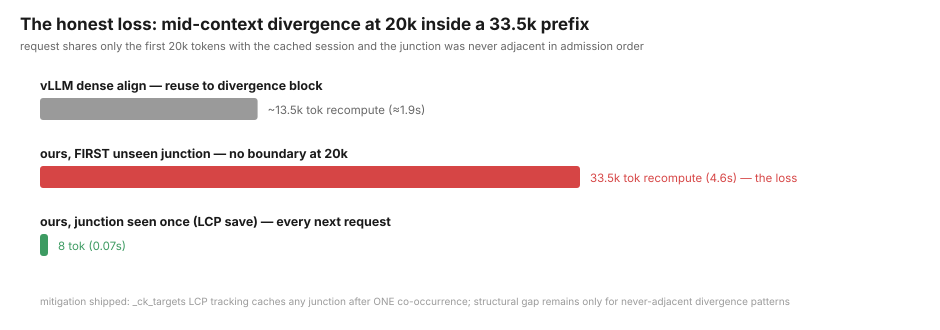

production runs under `tools/serve_prod.sh` (restart wrapper, core dumps enabled); the
engine exits after 8 consecutive step errors instead of zombie-serving a dead cuda
context, and a stale pending-quant record can no longer leak across waves (the old
`rc=-94` cascade — kernel-log-confirmed as xid 31 null-pointer writes — is gone: zero
gpu faults under real 40-60k-token traffic on the fixed build).

### prefill — the gemm deficit is closed

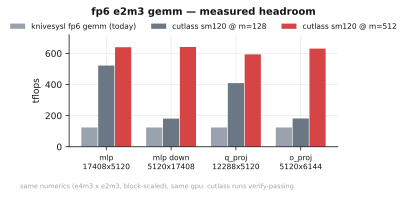

the hand-written fp6 gemm used to run at **124 tflops** against cutlass 4.8's sm120
block-scaled collective at 255 (m=128) / 572 (m=512) on the identical numerics and
shapes. it ran one warp per cta with every operand arriving from global through `__ldg`.
it is now a proper tiled kernel: 128-row x 256-column block tile, 8 warps, k staged 128
at a time into a `cp.async` circular buffer, split-k on `grid.y`. flop-weighted over this
model's real projection mix:

| columns/wave | before | after | cutlass sm120 collective |
|---|--:|--:|--:|
| 128 | 88.9 tflops | **392.8** | 255 (its m=128) |
| 256 | 88.1 tflops | **477.7** | 572 (its m=512) |

at `k_splits == 1` it is **bit-exact** vs the kernel it replaces — verified with
exactly-representable operands so summation order cannot mask an indexing bug. the two
largest projections now run at 1.29-1.40 tb/s, i.e. against the dram roofline rather
than the tensor cores.

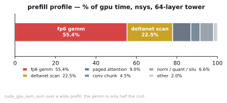

the gemm was 55% of prefill and the 48 gated-deltanet layers' chunkwise scan 22.5%, so
the scan was rewritten too — recurrent state held in registers across the whole chunk
instead of re-read and re-written every 8 tokens, the per-token prep hoisted out of the
sub-chunk loop and parallelised, and the idle-lane substitution phase removed. 1.56-1.59x
at every chunk width. the scan has since been rewritten AGAIN as a chunk-64 factored
matmul (`TQ_DN_MM`): every state-independent quantity hoists to a fully parallel prep
and the serial dimension shrinks 32 -> 4 steps of register-tiled fp32 matmuls per 256
tokens — 269 -> 188 us/layer-wave, needle 4/4 at 262k, paged parity 11/11.

```
prefill, single stream, 4096-token prompt:  2579 --> 4630 tok/s   (1.80x)
prefill, paged, 32 clients x 2048 tokens:   1198 --> 2216 tok/s   (1.85x)
```

with the nvfp4 w4a4 tier, tma staging, the matmul scan, 512-column waves and the
z-batched gemm column tiles on top, the same 4096-token single-stream prefill is now
**7769 tok/s** (8042 at 2048) and the paged path 6948 at n=1.

**and the server-level comparison has now been run against vllm's real production
config** -- same client, both engines over http. the earlier run used `--enforce-eager`,
which i wrongly believed this checkpoint forced; `--language-model-only` skips the vision
tower and vllm runs its full config, cuda graphs included, which is worth **2.3x** to its
decode:

`vllm serve unsloth/Qwen3.8-27B-NVFP4 --max-model-len 140000 --max-num-seqs 32
--gpu-memory-utilization 0.92 --kv-cache-dtype fp8 --max-num-batched-tokens 8192
--enable-prefix-caching --language-model-only`

| | vllm | knivesysl | |
|---|--:|--:|---|
| prefill 2048, unique, cold (fresh server) | 5218 | 7939 | 1.52x ours |
| prefill 2048, unique, fully warm | 10304 | 8026 | 1.28x theirs |
| prefill 4096, unique, fully warm | 16080 | 7544 | 2.13x theirs |
| prefill 4096, shared prefix, warm | 40282 | **174093** | **4.32x ours** |
| prefill 16384 (conc 2) | 10104 | 6157 | 1.64x theirs |
| prefill 16384 | 9173 | 8896 | 3.1% behind |
| prefill 32768 | 7978 | 7524 | 6.0% behind |
| prefill 65536 | 6090 | 5743 | 6.0% behind |
| prefill 98304 | 4908 | 4645 | 5.7% behind |
| prefill 131072 | **cannot (max-len 116032)** | **3885** | ours alone |

(cold, same client, both servers fresh, vllm prefix cache off. one day of
probe-driven campaigns -- gqa-shared attention, wide-wave ks=1, full-width
waves, the paged conv routing fix, fused silu quantization -- moved the band
from 1.28-1.60x behind to **3-6%**, every change bit-exact-gated)
| ttft p50, 8 clients x 2048 | 1.425 s | **1.230 s** | ours |
| decode n=1, paged | 69.2 | 61.1 | 1.13x theirs |
| decode n=1, fp6 mtp spec decode | 69.2 | **141.4** | **2.04x ours** |

**the honest summary: we win shared-prefix prefill ~4.3x, single-request cold starts,
ttft under batch load, and single-stream decode when the fp6 spec-decode path is used
(2x). vllm's fully-warmed unique prefill is ahead — 1.4x at 2k growing to 2.6x at 64k —
and its lead grows with context because its flashattention prefill scales better than
our wide-attention kernel.** their kv is fp8 and ours is int4, so quality is not
like-for-like. the n>1 server decode cells are prefill-residency-bound in both engines:
engine-level our paged decode is 17.98 ms/step at n=8 and 20.0 at n=16 — within 5% of
theirs — so those cells track the prefill gap, not the decode kernels. what remains is
(a) long-context prefill attention, now the largest single deficit, and (b) the gemm at
54% of this card's measured 2051 tflop/s fp4 issue roof against cutlass's 68%.

### decode at depth — gqa-shared paged attention

the paged decode attention ran one cta per *query* head, and this model is 24 q heads
over 4 kv heads, so six ctas independently streamed the same kv rows. at 131k context
that was ~21 gib of kv traffic per step for a 3.5 gib working set — 27 of the 46 ms. one
cta now carries all six query heads that share a kv head:

| case | before | after | |
|---|--:|--:|--:|
| n=32, ctx 2048 | 41.98 ms | **29.36** | 1.43x |
| n=1, ctx 65536 | 31.31 | **21.93** | 1.43x |
| n=1, ctx 131072 | 46.53 | **27.83** | 1.67x |
| n=1, ctx 147456 | 50.06 | **29.24** | 1.71x |

6/6 argmax match vs single-stream q4 decode. the projection gemm inside a decode step
now sustains 1.56 tb/s = 87% of this card's dram peak, so decode's remaining headroom is
attention and the deltanet recurrence, not the weight read.

---

## how it works

- **weights** — fp6 e2m3, 128-wide pow2 block scales, stored in the qmma fragment layout
  the tensor cores want. ~20 gib for 27b.
- **kv cache** — 4-bit k (rotated int4 + hadamard) + e4m3 v. this is what buys 256k.
- **attention** — 16 full-attention layers on hand-written `mma.sync ...
  kind::mxf8f6f4.block_scale` with `ldmatrix ... b6x16` fp6 unpack; 48 gated-deltanet
  layers on a fused chunkwise scan.
- **spec decode** — an mtp covering tree --> batched k-split fp6 verify (weights read once
  for the whole tree) --> dense-argmax descent --> single-path commit.
- **prefill** — one wide fp6 gemm per projection --> chunk-parallel deltanet --> tensor-core
  wide attention against the q4 cache at any length.
- **batching** — paged kv pool, continuous batching, decode rows fused into prompt waves
  so both ride one weight read.

everything is compiled by stock `nvcc`/`ptxas` from cuda 13. no external assembler, no
precompiled cubins.

---

## build

```bash
export PATH=/usr/local/cuda/bin:$PATH
cmake -B build-qwen -DCMAKE_CUDA_ARCHITECTURES=120
cmake --build build-qwen --target knivesysl-forward-qwen -j
# -> build-qwen/libforward_qwen.so
```

requires an sm120 blackwell part (rtx 5090 / rtx pro 6000), cuda 12.8+, and python 3.10+
with `torch`, `transformers`, `numpy`, `safetensors` for the converter.

## get the weights

either pull our conversion:

```bash
huggingface-cli download srswti/axe-strada-knivesysl-27b --local-dir ./model
# 22.6 gb .tqf + tokenizer + chat template; --model-dir points at this same dir
```

or convert an hf checkpoint yourself:

```bash
TQ_EMIT_MTP=1 TQ_GPU_PACK=1 python3 tools/convert_qwen_tqf.py /path/to/qwen3.8-27b \
    -o model.tqf --block-scaled always --block-layout qmma-e2m3 --block-scale-policy pow2
```

`--block-scaled always` and `--block-layout qmma-e2m3` are both required; without them the
converter silently falls back to global-scale fp8. without `TQ_EMIT_MTP=1` there is no
spec-decode head. `TQ_GPU_PACK=1` quantizes on the gpu — 43 s instead of ~13 min.

verify with `python3 tools/inspect_tqf.py model.tqf`: a good file reports
`block_scaled_e2m3: True`, `has_mtp_section: True`, flags `0x53d`, ~22.6 gb.

## serve

```bash
tools/serve.sh                 # foreground, auto-sizes TQ_CTX from free vram
tools/serve.sh daemon          # detached (setsid), waits for readiness
tools/serve.sh status | logs | stop
```

or explicitly:

```bash
CUDA_VISIBLE_DEVICES=0 TQ_CTX=262144 TQ_KV_Q4=1 TQ_EMBED_FP8=2 \
    python3 tools/serve_openai.py --port 8000 \
    --tqf model.tqf --model-dir /path/to/qwen3.8-27b \
    --lib build-qwen/libforward_qwen.so
```

`TQ_EMBED_FP8=2` (6-bit embed table) is what makes the full 256k window fit in 32 gb. the
kv pool is sized by `TQ_CTX` and allocated on the first request, so an oversized context
dies mid-request rather than at load — `serve.sh` sizes it from free vram for you.

many-client mode:

```bash
CUDA_VISIBLE_DEVICES=0 TQ_CTX=32768 TQ_KV_Q4=1 python3 tools/serve_batched.py \
    --port 8100 --max-slots 32 --num-blocks 1024 --tqf model.tqf --model-dir ...
```

### terminal coding client

`tools/axe_vllm.py` runs the agentic terminal client against any live
OpenAI-compatible vLLM server. It defaults to `http://127.0.0.1:8000/v1`, discovers the
served model from `/v1/models`, streams thinking separately from the final response, and
preserves assistant/tool history so server-side prefix caching can reuse completed turns.

```bash
# use a Python environment containing openai, python-dotenv, and tiktoken
# (plus ddgs and trafilatura for the web_search tool)
/path/to/vllm/.venv/bin/python tools/axe_vllm.py /path/to/project

# optional endpoint/model overrides
VLLM_BASE_URL=http://127.0.0.1:8000/v1 VLLM_MODEL=your/model \
    /path/to/vllm/.venv/bin/python tools/axe_vllm.py /path/to/project
```

Thinking is enabled and printed under `thinking>` by default; `--no-thinking` explicitly
disables it. Interactive commands are `/model`, `/clear`, and `/quit`. `--prompt` runs one
non-interactive agent turn, including tool calls, for automation and smoke tests.

`web_search` searches DuckDuckGo via `ddgs`, scrapes the top result pages with
`trafilatura`, and sends the digest to the same model the agent is running on; the
tool output is that model's summary of the links and what it found (a non-streaming
completion on the same client, `enable_thinking` off). if the summarisation call fails,
the raw scraped digest is returned instead.

### reasoning effort

qwen3.8's chat template owns it: `reasoning_effort` in `low | medium | xhigh` (default
`xhigh`) selects a system-level instruction. we pass the tier through and fold `high`/`max`
onto `xhigh` so an openai-vocabulary client gets an answer instead of a 400. accepted as
`reasoning_effort`, `reasoningEffort`, or `reasoning.effort` on both endpoints.
`preserve_thinking` rides along, and preserved thinking keeps the prefix cache live across
turns.

### key flags

| flag | meaning |
|---|---|
| `TQ_CTX` | max context (engine cap 262144; 131072 serves in 26.6 GB on the nvfp4 tier) |
| `TQ_KV_Q4=1` | 4-bit k + e4m3 v cache (needed for 256k) |
| `TQ_EMBED_FP8=2` | 6-bit embed table, -1.5 gib |
| `TQ_PAGED_SPLIT` | force split-k on/off for paged decode attention |
| `TQ_PAGED_GQA=0` | revert paged decode attention to one cta per query head |
| `TQ_WIDE_GEMM=0` | revert the wide fp6 projection gemm to the 1-warp/cta kernel |
| `TQ_GEMM_STAGES` | wide-gemm `cp.async` pipeline depth (2..4, default 2) |
| `TQ_WAVE_MAX` | max wave columns the engine accepts (default 2048; builders pick 512 shallow / 2048 past 16k depth) |
| `TQ_W_E2M1=1` | opt-in 4-bit weight tier (k32 mma: memory win only, no compute win) |
| `TQ_W_NVFP4=all` | nvfp4 w4a4 tier, every projection (k64 mma: 2.05x instruction roof) |
| `TQ_W_NVFP4=mlp` | nvfp4 for the mlp only; attention + deltanet stay fp6 |
| `TQ_NVFP4_STAGES` | nvfp4 gemm pipeline depth fallback (autotuned per shape at load) |
| `TQ_NVFP4_TMA=0` | revert the nvfp4 gemm from `cp.async.bulk.tensor` to `cp.async` |
| `TQ_WIDE_ATTN_MMA=0` | revert prefill attention to the scalar/split-k decode kernel |
| `TQ_WIDE_ATTN_QROWS` | force 16/32/64-row per-head attention tiles (only when gqa is off) |
| `TQ_WIDE_ATTN_GQA=0` | revert to per-query-head attention ctas (default on: one cta per kv head, 96 packed rows) |
| `TQ_WIDE_ATTN_SPLIT` | key-split chunk for the prefill attention (default 8192, S capped at 8) |
| `TQ_WIDE_ATTN_PROBE` | timing scaffolds for the gqa kernel (WRONG numerics; cost attribution only) |
| `TQ_DN_MM` | deltanet chunk-64 matmul scan: 3 = tf32 wmma (default, gates at the eps band), 1 = fp32 scan (conservative), 0 = ck8 head-split scan |
| `--fuse-idle-ms` | ride a decode row on a prompt wave only after this idle time (default 125; riding costs 1.2 ms/row/wave) |
| `--prefill-budget` | prompt columns per wave, on top of the decode rows |
| `--prefix-cache` | materialize a shared prompt prefix once (batched server) |

## verify

```bash
python3 tools/mtp_spec_smoke.py --prompt-tokens 1024 --gen 128 --tqf model.tqf ...
python3 tools/bench_rounds.py  --prompt-tokens 65536 --rounds 200 --tqf model.tqf ...
python3 tools/needle_check.py                      # long-context retrieval gate
python3 tools/paged_smoke.py                       # paged decode == single-stream argmax
python3 tools/bench_decode.py --cases 1:2048,32:2048,1:131072
python3 tools/tf_agreement.py --chunk 256          # then diff two runs position by position
TQ_W_NVFP4=mlp python3 tools/nvfp4_check.py       # nvfp4 vs fp64 decode of the same bytes
TQ_W_NVFP4=mlp python3 tools/nvfp4_quality.py     # then diff ARGMAX against a TQ_W_NVFP4=0 run
```

## layout

```
src/forward_qwen.cu        the engine: every kernel + the c abi, one cuda tu
tools/serve_openai.py      single-stream server (prefix cache, tools, reasoning split)
tools/serve_batched.py     multi-client server (paged kv + continuous batching)
tools/serve.sh             launcher: env defaults, vram-sized TQ_CTX, daemon/stop/status
tools/convert_qwen_tqf.py  hf qwen --> .tqf converter
tools/inspect_tqf.py       inspect a .tqf
tools/bench_coding.py      cold/follow-up coding-workload benchmark
tools/bench_decode.py      paged decode sweep (concurrency x context depth)
tools/tf_agreement.py      teacher-forced top-1 agreement between two libs/configs
tools/bench_endpoint.py    http endpoint sweep (any engine, unique vs shared prefix)
tools/quant_study.py       quantizer error on W@x: repack vs direct vs rotations
tools/dump_activations.py  real activations for quant_study (synthetic data lies)
tools/nvfp4_check.py       nvfp4 numeric gate (fp64 decode of the packed bytes)
tools/nvfp4_quality.py     nvfp4 wide-path argmax agreement (tf_agreement can't reach it)
```

see `CHANGELOG.md` for the measurement log behind every number here.

## where this is going

**done: the gqa-shared attention rewrite** (`k_tq_wide_attn_mma6`, default on) -
one cta per kv head, six query heads packed into the mma's m dimension, cp.async
K staging, 8-row batched q prep. engine +1.3% at 2k growing to +8.3% at 96k;
the server band vs vllm narrowed to 1.21-1.34x. `TQ_WIDE_ATTN_PROBE` scaffolds
attribute the remaining cost: the mma-issue floor + gemm + deltanet - i.e. the
megakernel/tma lever below, not more attention scheduling.

**next steps, in order:**

1. nvfp4 gemv decode kernel - lift the single-stream `-120` guard so the nvfp4
   tiers get the fp6 spec-decode path (~60 -> ~135+ tok/s interactive)
2. warm unique-prefill gemm: the tma producer/consumer pipeline rewrite
   (cutlass-class scheduling; closes the 1.28-2.13x warm 2-4k cells)
3. **the 4-5x ladder** (after vllm is beaten everywhere) - the dense fp4 issue
   roof on this card is 2051 tf/s (~38k tok/s ceiling), so the leap must change
   the work, not just the efficiency:
   - 2:4 structured sparsity (`mma.sp`, `TQ_FLAG_SPARSE_24_E2M3` reserved): x2 roof
   - whole-prompt waves (weights read once per prefill): x1.2-1.3, unblocked by
     the gqa attention rewrite above
   - per-layer persistent megakernel (activations never touch dram): x1.2-1.4
   - deltanet-scan/gemm co-scheduling on partitioned sms: x1.10-1.15
   - l2 weight prefetch + pdl kernel-tail overlap: x1.03-1.05
4. more models - the converter and the format are architecture-agnostic; the
   kernels are not, yet

